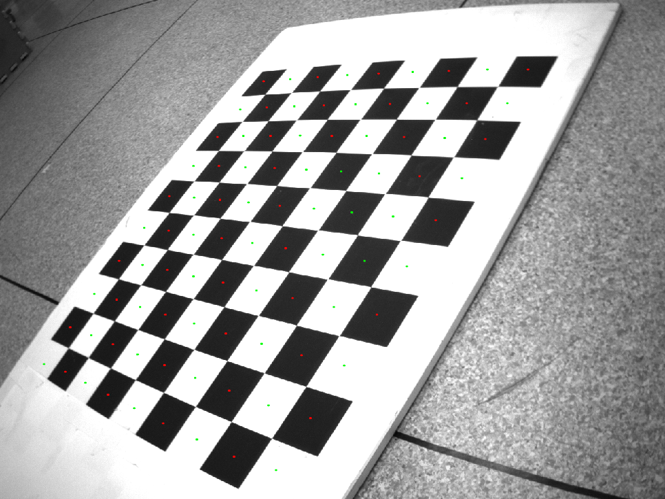
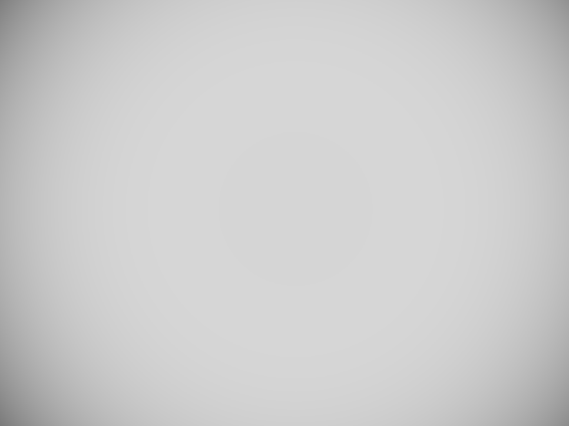
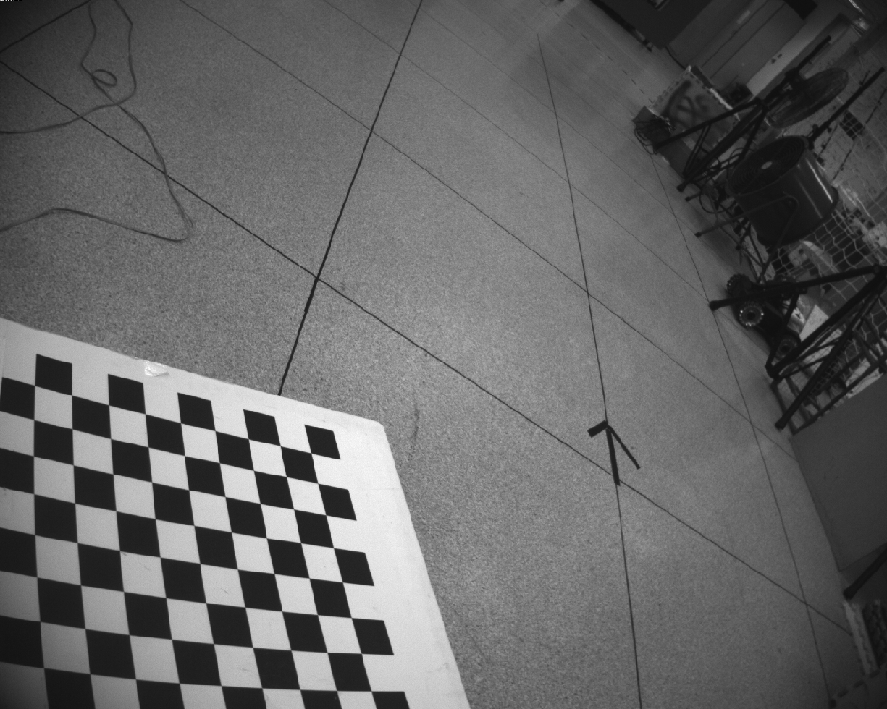
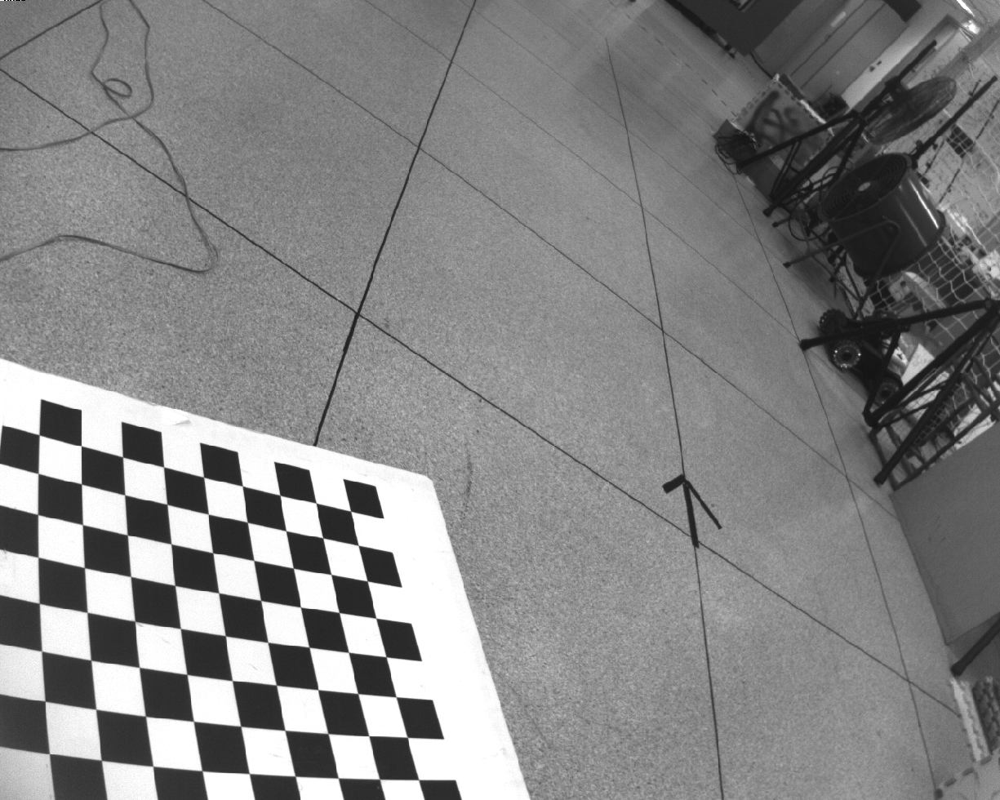
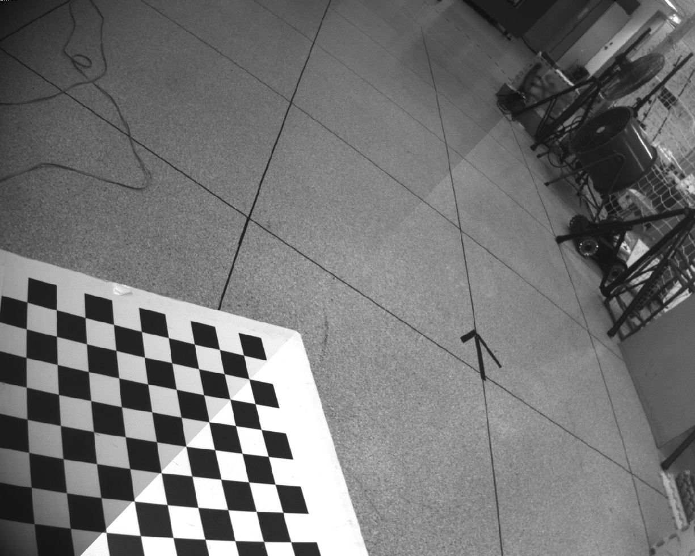

# vignetting_calib

## A useful tool for camera vignetting calibration

`vignetting_calib` us an offline camera vignetting calibration and correction tool.
The calibration is easy with a chessboard in a light uniform environment.

**Authors:** [Wenlaing GAO](https://gaowenliang.github.io)


## Build

### Prerequisites

**ROS**

ROS Kinetic on Ubuntu 16.04: [ROS Installation](http://wiki.ros.org/indigo/Installation/Ubuntu).


Other ROS pacakge requisites: special version [`camera_model`](https://github.com/gaowenliang/camera_model "camera_model"), [`code_utils`](https://github.com/gaowenliang/code_utils "code_utils").

For image ccollection, use [`calib_image_saver`](https://github.com/gaowenliang/calib_image_saver "calib_image_saver").


### **Ceres Solver**
Follow [`Ceres-Solver Installation`](http://ceres-solver.org/installation.html "Ceres-Solver"), remember to **make install**.
(Our testing environment: Ubuntu 16.04, ROS Kinetic, OpenCV 3.2.0, Eigen 3.2.0) 

### Build VINS-OS

Clone the repository and catkin_make:
```
    cd TO-YOUR-ROS-CATKIN-WORKSPACE
    git clone git@github.com:gaowenliang/vignetting_calib.git
    cd ../
    catkin_make
```

## Run with your device 

### 1. camera intrinsic calibration

Collect chessboard images with [`calib_image_saver`](https://github.com/gaowenliang/calib_image_saver "calib_image_saver").

Calibrate the intrinsic parameters using the tool in [`camera_model`](https://github.com/gaowenliang/camera_model "camera_model").

### 2. vignetting calibration
Check the threshold between the black squares and the write squares. Finish
```
./vignetting_calib --camera-name wkx --input wkx/ -p IMG_ -e png -w 9 -h 8 --size 70 --opencv true --resize-scale 1.0 --cropper_width 0 --cropper_height 0 --center_x 640 --center_y 512 --save_result true --is_color false --threshold 45
```
If the threshold is right, the chessboard in the oputput images will be marked with green and red points. 



### the sample output 

vignetting map:



sample parameter:

```
model_type: VIGNETTING
image_width: 1280
image_height: 960
center_x: 6.6464141845703125e+02
center_y: 4.7054119873046875e+02
is_color_cam: 0
channel: 1
vignetting_parameters:
   channel0:
      k0: 2.1326925528903553e+02
      k1: 3.2458047022269182e-05
      k2: -2.3826953130897426e-10
      k3: 0.
```

## vignetting correction
Raw image:



correction image:



compared image:




